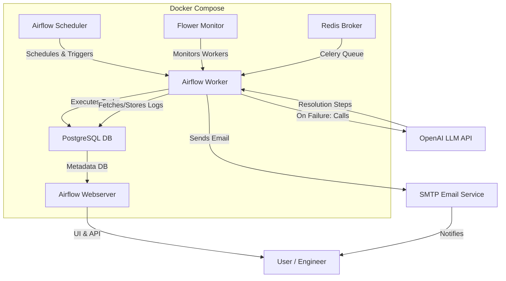

# Project Documentation: Leveraging LLM for Airflow Log Analysis and Resolution

---

## 🌟 Overview

This project integrates **Apache Airflow** with **Large Language Models (LLMs)** (via OpenAI) to automatically analyze Airflow logs and provide actionable resolution steps for failed tasks. The goal is to enhance workflow reliability, reduce downtime, and build a knowledge base of issues and solutions.

---

## 🏗️ Architecture



---

## 🧩 Components

- **Airflow Webserver**: User interface for managing DAGs and monitoring workflows.
- **Airflow Scheduler**: Schedules DAG runs and triggers tasks.
- **Airflow Worker**: Executes tasks, monitors logs, and triggers LLM analysis on failure.
- **PostgreSQL**: Stores Airflow metadata.
- **Redis**: Acts as the Celery broker for distributed task execution.
- **Flower**: Monitors Celery workers.
- **OpenAI LLM**: Analyzes logs and generates resolution steps (via Python API).
- **SMTP Email**: Sends actionable resolution steps to users.

---

## ⚙️ How It Works

1. **Task Execution**: Airflow runs scheduled tasks as defined in your DAGs.
2. **Log Monitoring**: If a task fails, the worker collects the relevant logs.
3. **LLM Analysis**: The logs are sent to OpenAI's LLM using the `openai` Python package.
4. **Resolution Generation**: The LLM interprets the logs and generates actionable resolution steps.
5. **Notification**: The system emails these steps to the responsible user/team.
6. **Knowledge Base**: All analyzed logs and resolutions are stored for future reference.

---

## 🚀 Setup Instructions

1. **Clone the Repository**
   ```bash
   git clone <your-repo-url>
   cd airflow-docker
   ```

2. **Configure Environment Variables**
   - Edit the `.env` file to set sensitive values (e.g., SMTP password).

3. **Build and Start the Stack**
   ```bash
   docker-compose up --build
   ```

4. **Access Airflow UI**
   - Visit [http://localhost:8080](http://localhost:8080)
   - Default credentials: `airflow` / `airflow` (unless changed in `.env`)

5. **Add Your DAGs**
   - Place your DAG Python files in the `dags/` directory.

6. **Install Python Dependencies**
   - The `openai` package is installed automatically in the Airflow containers.

---

## 🤖 LLM Integration

- The project uses the `openai` Python package to interact with OpenAI's LLMs.
- On task failure, Airflow code (DAG or plugin) sends the relevant log snippet to the LLM.
- The LLM returns a human-readable analysis and resolution steps.
- These are emailed to the user via SMTP (Gmail is pre-configured).

---

## 💡 Benefits

- **Automated Log Analysis**: No more manual log sifting—get instant insights.
- **Actionable Steps**: Receive clear, AI-generated instructions to resolve issues.
- **Faster Recovery**: Reduce downtime and improve workflow reliability.
- **Knowledge Repository**: Build a searchable archive of past issues and solutions.

---

## ❓ FAQ

**Q: Where do I put my DAGs?**  
A: Place them in the `dags/` directory.

**Q: How do I configure email notifications?**  
A: Edit the SMTP settings in `docker-compose.yaml` or the `.env` file.

**Q: How does the LLM get called?**  
A: On task failure, custom Airflow code (to be placed in `dags/` or `plugins/`) sends logs to OpenAI and processes the response.

**Q: Can I use a different LLM provider?**  
A: Yes, update the Python code to use your preferred LLM API and adjust dependencies.

---

## 🎨 Tips for Customization

- Add your own DAGs to automate your workflows.
- Extend the log analysis logic in Python for more advanced use cases.
- Integrate with other notification channels (Slack, Teams, etc.) as needed.

---

## 📚 References

- [Apache Airflow Documentation](https://airflow.apache.org/docs/)
- [OpenAI Python API](https://platform.openai.com/docs/api-reference)
- [Docker Compose Docs](https://docs.docker.com/compose/)

---

*This documentation was auto-generated for clarity, interactivity, and ease of onboarding. Enjoy your AI-powered Airflow!*
